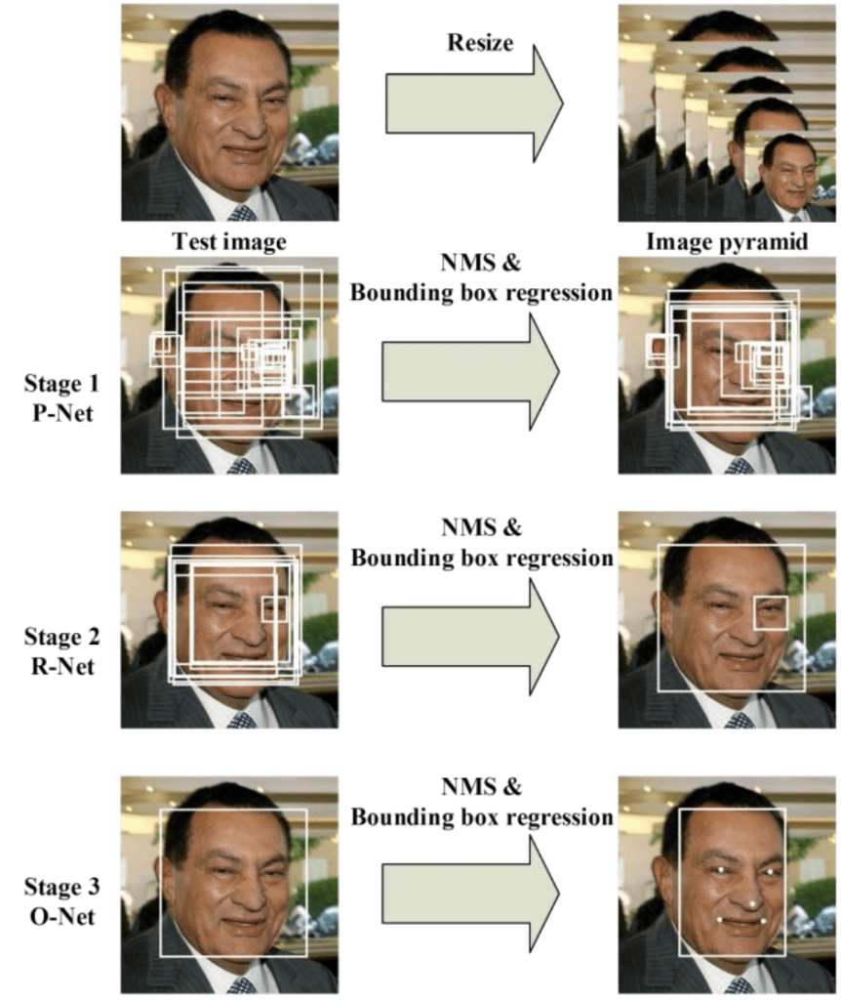
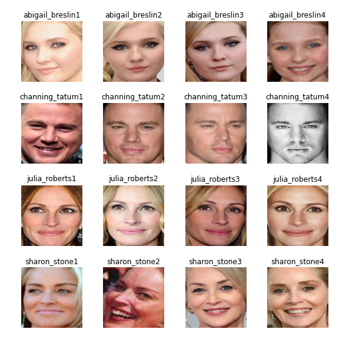
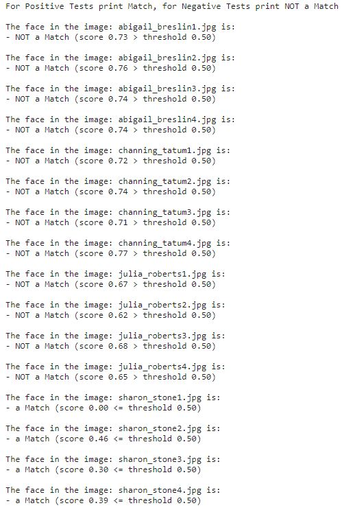

# Keras VGGFace2
Face recognition is the general task of identifying and verifying people from photographs of their faces. Face Recognition describes two main modes for face recognition:
* Face Verification: a one-to-one mapping of a given face against a known identity (e.g. is this the person?).
* Face Identification: a one-to-many mapping for a given face against a dataset of known faces (e.g. who is this person?).

VGGFace2 is a very deep CNN architecture, which learned on a large-scale dataset, is used as a feature extractor to extract the activation vector of the fully connected layer in the CNN architecture. Before we can perform face recognition, we need to detect faces. Face detection is the process of automatically locating faces in a photograph and localizing them by drawing a bounding box around their extent. 

#### MTCNN
We will use the MTCNN, for face detection. Multi-task Cascaded Convolutional Networks (MTCNN) is a framework developed as a solution for both face detection and face alignment. The process consists of three stages of convolutional networks that are able to recognize faces and landmark location such as eyes, nose, and mouth. The Three Stages of MTCNN: first, the image is rescaled to a range of different sizes (called an image pyramid), then the first model (Proposal Network or P-Net) proposes candidate facial regions, the second model (Refine Network or R-Net) filters the bounding boxes, and the third model (Output Network or O-Net) proposes facial landmarks. The figure below provides a summary of the three stages from top-to-bottom and the output of each stage left to right.

<p align="center">
  
</p>

#### VGGFace2
Next, we will use the VGGFace2 model, for face verification. It involves calculating a face embedding for a new given face and comparing the embedding to the embedding for the single example of the face known to the system. A face embedding is a vector that represents the features extracted from the face. This can then be compared with the vectors generated for other faces. For example, another vector that is close (by some measure) may be the same person, whereas another vector that is far (by some measure) may be a different person. Typical measures such as Euclidean distance and Cosine distance are calculated between two embeddings and faces are said to match or verify if the distance is below a predefined threshold, often tuned for a specific dataset or application. 

#### keras-vggface
The keras-vggface library provides three pre-trained VGGModels, a VGGFace1 model via model=’vgg16′ (the default), and two VGGFace2 models ‘resnet50‘ and ‘senet50‘.
```python

from keras_vggface.vggface import VGGFace

# Based on VGG16 architecture -> old paper(2015)
vggface = VGGFace(model='vgg16') # or VGGFace() as default

# Based on RESNET50 architecture -> new paper(2017)
vggface = VGGFace(model='resnet50')

# Based on SENET50 architecture -> new paper(2017)
vggface = VGGFace(model='senet50')

```

In this case, we will create a ‘resnet50‘ VGGFace2 model and check if the model correctly verifies images in which the celebrity Sharon Stone appears (positive cases that we would like to identify) and on the other hand, will not recognize images of other celebrities (negative cases) as Sharon Stone. 

## Requirements
~~~bash
pip install scipy
pip install numpy
pip install Pillow
pip install matplotlib
pip install opencv-python
pip install tensorflow
pip install Keras
pip install mtcnn

# installing keras-vggface
pip install git+https://github.com/rcmalli/keras-vggface.git
~~~

## Result
Running the program produces as an output the face identified in each image received as input and finally, a summary of the given cases. 
<p align="center">
  
  
</p>

We can see that the system correctly verified the two positive cases given photos of Sharon Stone. We can also see that the photos of Channing Tatum, Abigail Breslin, and Julia Roberts are correctly not verified as Sharon Stone.
